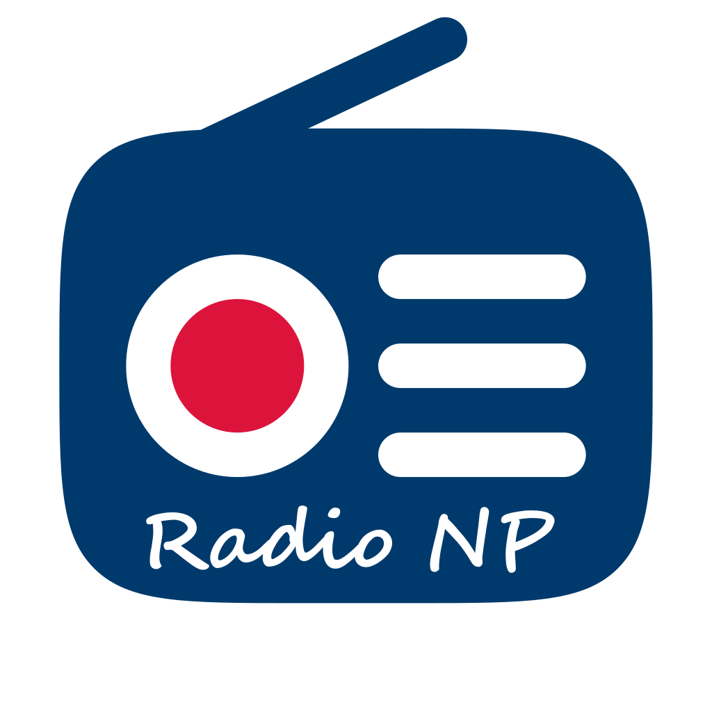
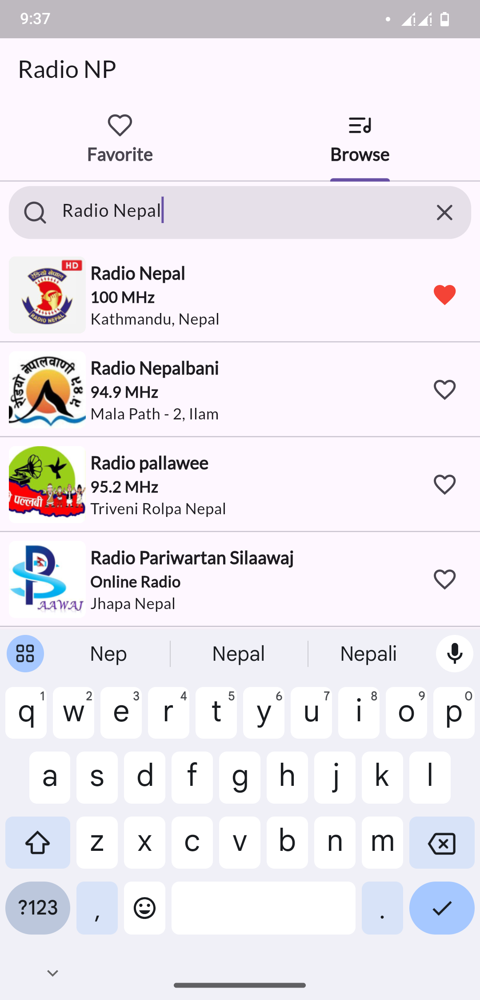

# Radio NP



Radio NP is a free and open source online radio app that provides access to all Nepali radio stations with a convenient favorite feature to save your preferred stations.

[](https://github.com/2shrestha22/radio/releases/latest)

[](https://play.google.com/store/apps/details?id=np.com.sargam.radio)

iOS? Apple does not allow streaming apps unless I obtain written permission from each station, which is literally impossible for me

## Screenshots

 

## Development

1. **Clone the repository**
   ```sh
   git clone https://github.com/2shrestha22/radio.git
   cd radio
   fluter run
   ```

## Radio Stations

Some radio stations are available with https connection and some don't. For mobile app both http and https connections can play well. But for web only https connection is allowed. So http radio station will not work in web.

Note: When updating `radio_list.json` pick either http or https url which works on mobile device since browser always going to use https anyway.
